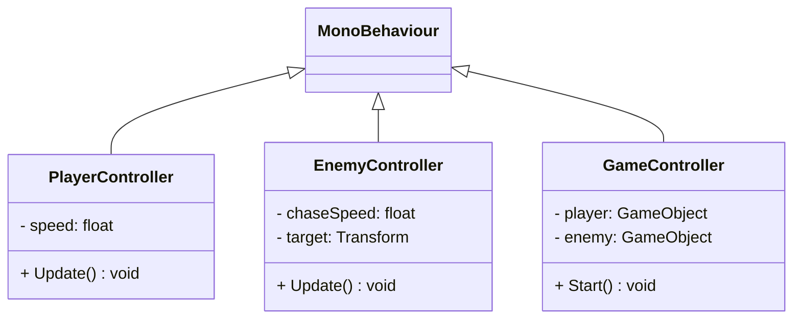

# 99-mermaid-smeerws

```mermaid
classDiagram
    MonoBehaviour <|-- PlayerController
    MonoBehaviour <|-- EnemyController
    MonoBehaviour <|-- GameController

    class GameController {
        - player: GameObject
        - enemy: GameObject 
        + Start() void 
    }
    class PlayerController {
        - speed: float
        + Update() void
    }

    class EnemyController {
        - chaseSpeed: float
        - target: Transform 
        + Update() void
    }
```
